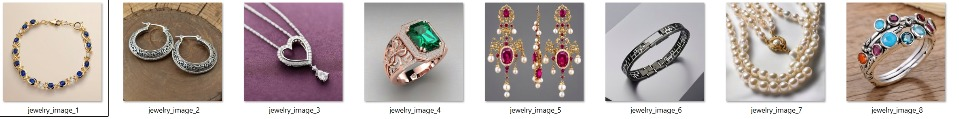
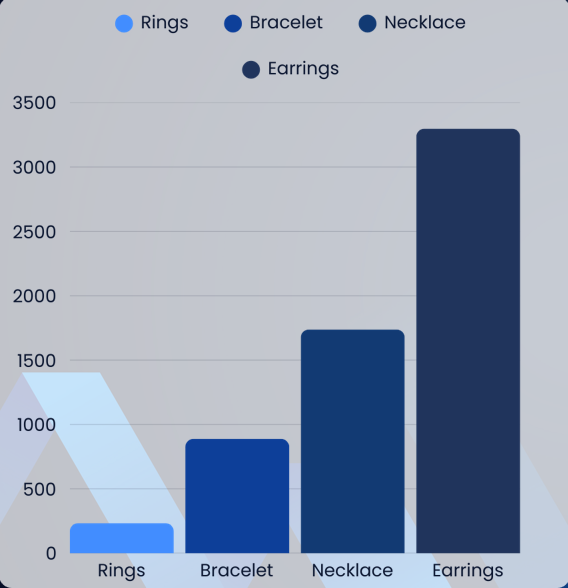
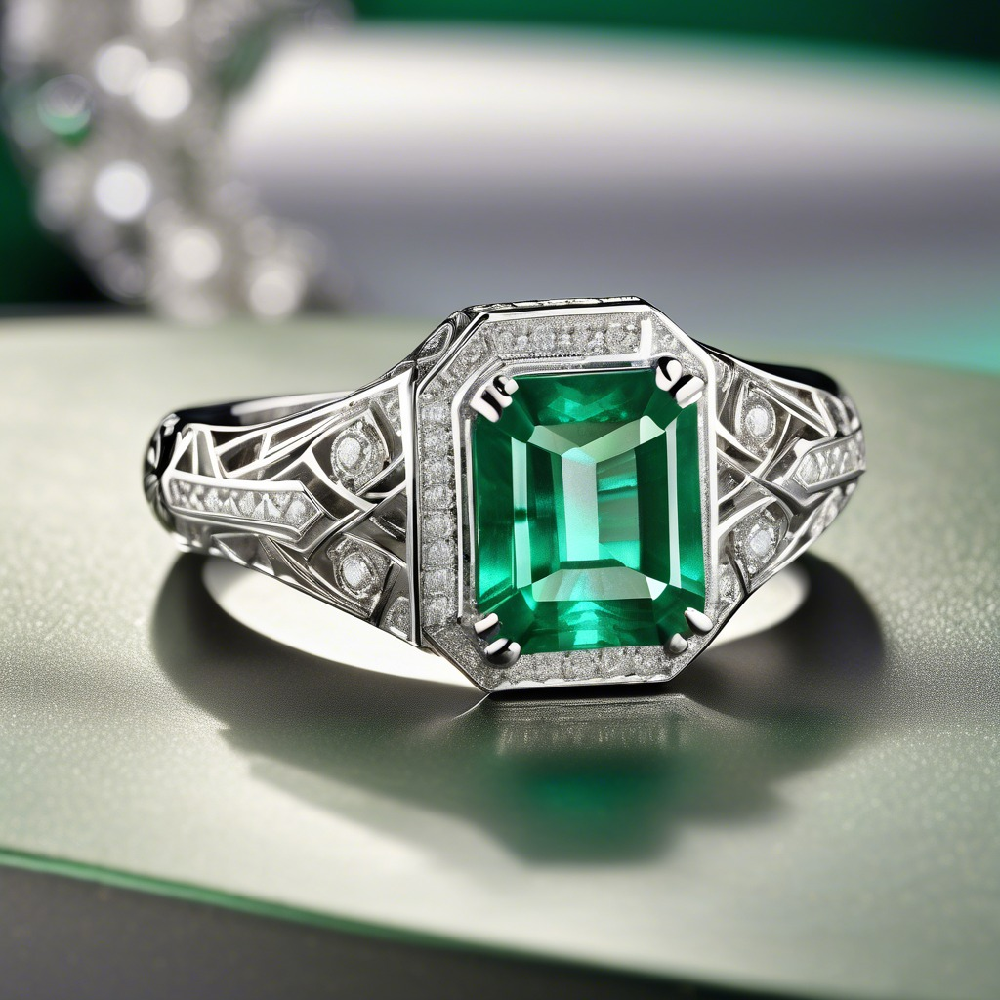
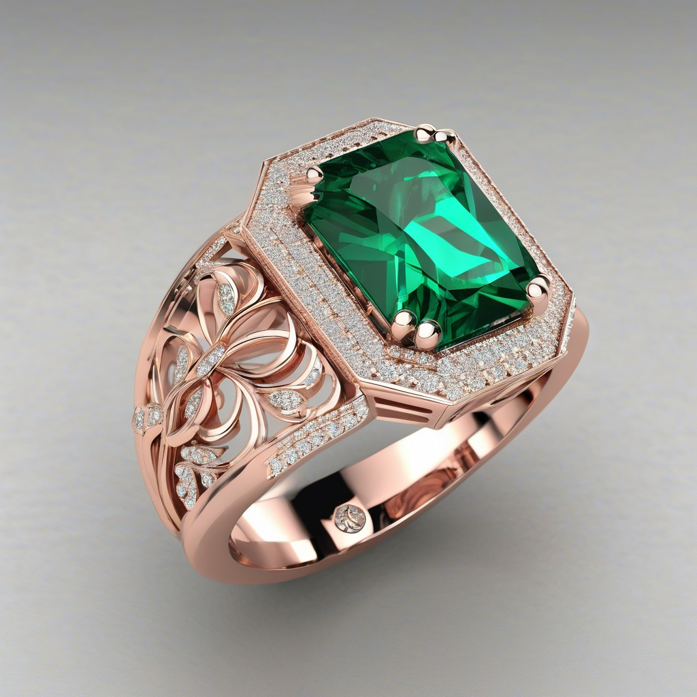
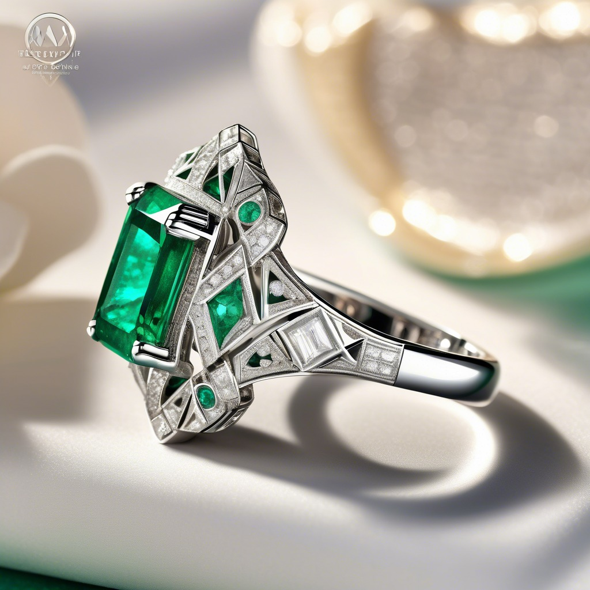
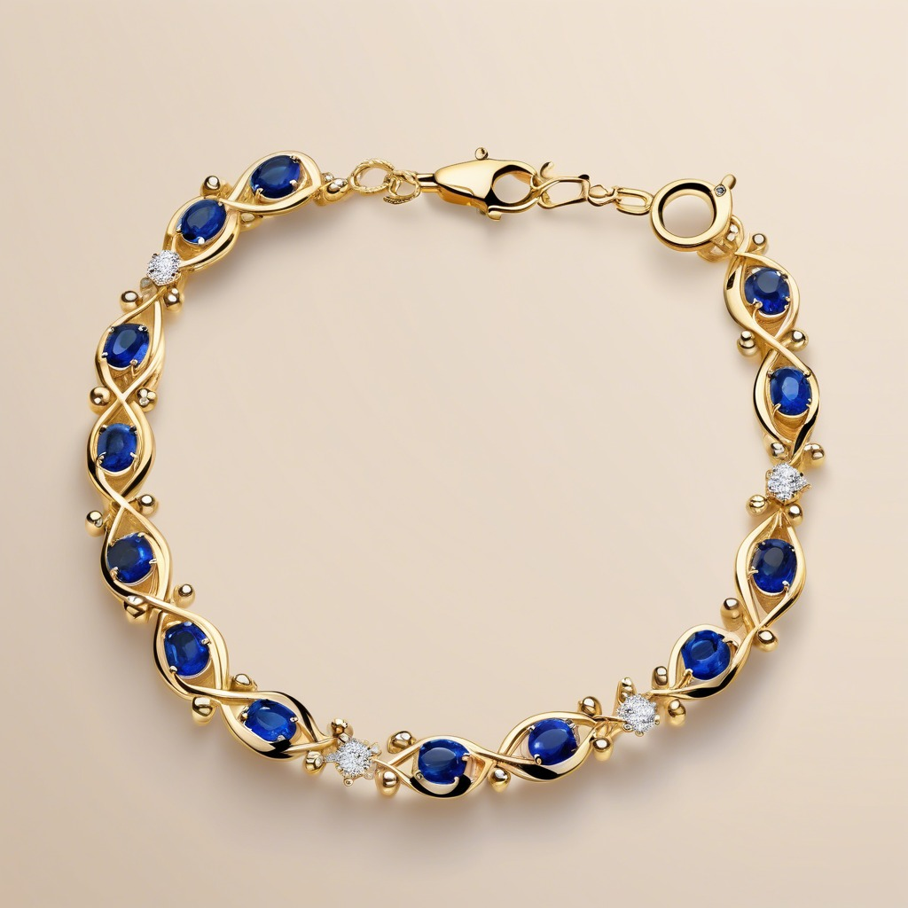
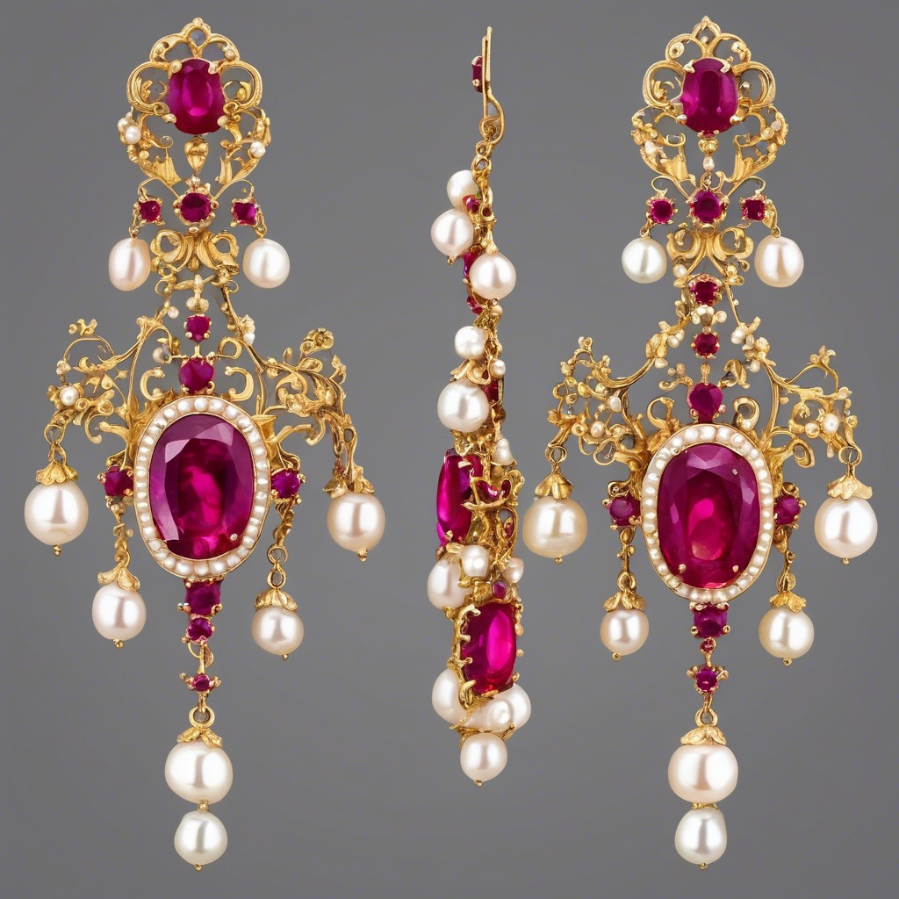
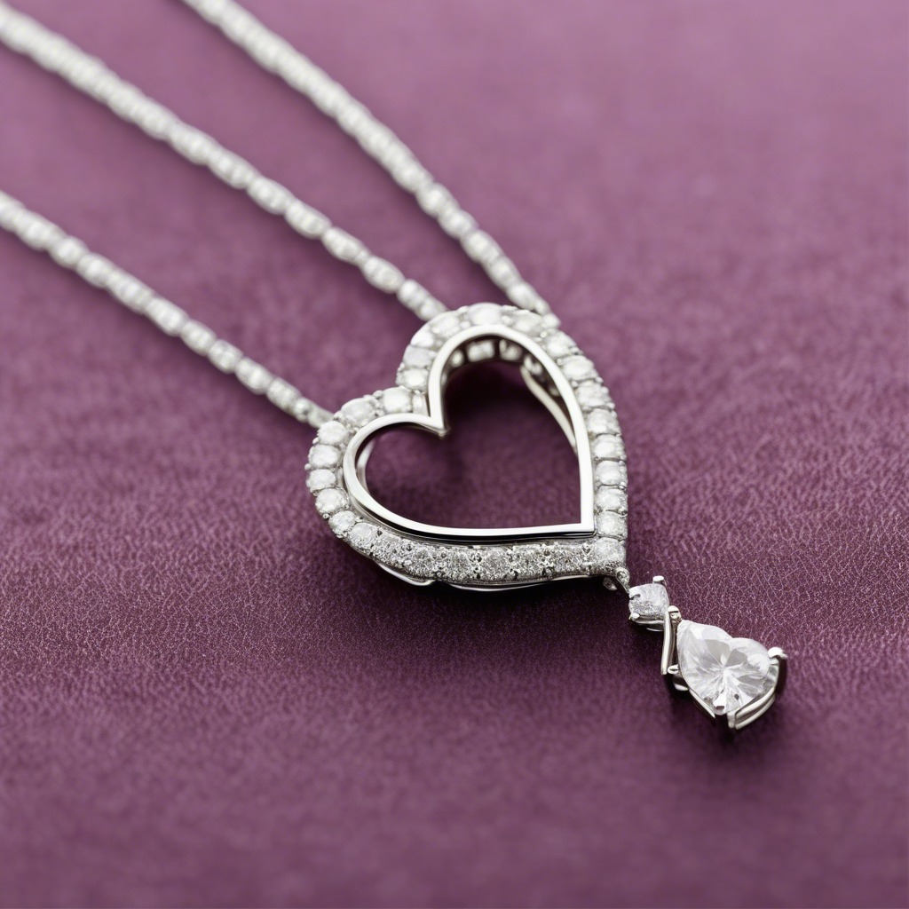
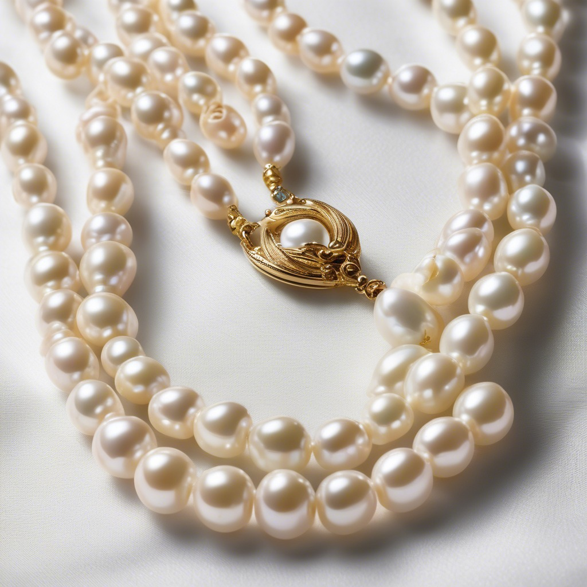
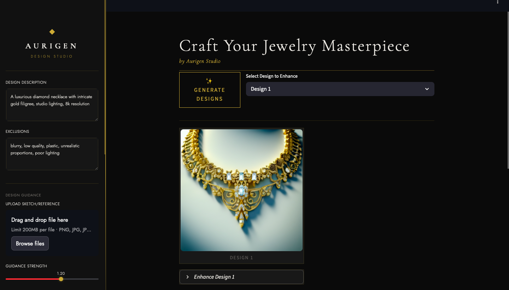

# 💍 Aurigen — AI-Powered Jewelry Design Studio

<div align="center">


**Generate photorealistic jewelry designs from text prompts or sketches
using fine-tuned Stable Diffusion XL + ControlNet.**

[📺 Watch Demo](https://drive.google.com/file/d/1wlOlAmbYkNzWX6YOuXDQcwJ9tjATD1ir/view?usp=drive_link) ·
[🤗 Dataset](https://huggingface.co/datasets/sidd707/jewelry-design-dataset) ·
[⚖️ Model Weights](https://drive.google.com/drive/folders/13bx0xMu9Py2vFqFG8ocny2YVamw7EQOX?usp=sharing)



</div>

---

## 🚩 Problem Statement

In traditional jewelry design, users are forced to rely on rough sketches or verbal descriptions, with little visibility into the final result. This leads to **design mismatches**, **costly revisions**, and **poor customer satisfaction**.

> 💡 Aurigen eliminates this uncertainty using generative AI — letting users explore photorealistic designs before committing to production.

---

## ✨ Key Features

- 🎨 **Text-to-Image Generation** — Describe your dream piece and watch it come to life using **Stable Diffusion XL**.
- 🧠 **Structure-Aware with ControlNet** — Upload rough sketches or auto-detect edges to guide the generation process.
- 🛠️ **Real-Time Design Studio** — Built with **Streamlit**, the interface lets you fine-tune prompts, guidance scale, and refine specific features live.
- 📁 **Novel Jewelry Dataset** — A self-curated collection of 6,000+ annotated images across four categories: Earrings, Necklaces, Rings, and Bracelets.

---

## 🧠 Tech Stack

| Area            | Technologies                                                        |
|-----------------|---------------------------------------------------------------------|
| Core ML Models  | Stable Diffusion XL, ControlNet                                     |
| ML Frameworks   | PyTorch, Hugging Face `diffusers`, OpenCV                           |
| UI & Deployment | Streamlit, HTML/CSS, PIL, NumPy                                     |
| Dataset Tools   | Custom scripts, Gemini API (image captioning), manual annotation    |

---

## 🗂️ Module Overview

| Module | Purpose | Key Imports | Exports |
|--------|---------|-------------|---------|
| `app/controlnet_app.py` | Streamlit UI entrypoint — sidebar controls, image display, generation and refinement loops. | `streamlit`, `torch`, `models`, `utils` | — (top-level app) |
| `models/sdxl_pipeline.py` | Loads the SDXL 1.0 + ControlNet Canny pipeline and optionally applies fine-tuned UNet weights from `fine-tuned-weights/unet_epoch_3.pth`. | `torch`, `diffusers` | `load_pipeline()` |
| `utils/image_utils.py` | Pure image-processing helpers: Canny edge detection and image loading/resizing for ControlNet input. | `cv2`, `numpy`, `PIL` | `detect_edges()`, `preprocess_image()` |

---

## 📁 Project Structure

```
Aurigen/
├── app/
│   └── controlnet_app.py            # Streamlit UI (entrypoint)
├── models/
│   ├── __init__.py
│   └── sdxl_pipeline.py             # SDXL + ControlNet pipeline loading
├── utils/
│   ├── __init__.py
│   └── image_utils.py               # Image preprocessing helpers
├── legacy/
│   ├── old_training_file.ipynb      # Archived — see legacy/README.md
│   ├── new_training_file.ipynb      # Archived — see legacy/README.md
│   └── README.md
├── docs/
│   └── architecture.md
├── fine-tuned-weights/
│   └── README.md                    # Download instructions
├── Dataset/                         # Hosted on HuggingFace (not in repo)
├── Assets/                          # README images
├── kaggle_streamlit_launcher.ipynb  # One-click Kaggle launcher (see below)
├── requirements.txt
├── .env.example
└── README.md
```

---

## 📊 Dataset Overview

- 📦 **Total Images:** 6,157
- 💎 **Classes:** Rings, Necklaces, Earrings, Bracelets
- 🧹 **Cleaned & Annotated:** Removed duplicates, filtered low-quality images, generated captions with Gemini, and manually verified each entry.

### Dataset Breakdown

| Category   | Images  |
|------------|--------:|
| Earrings   | 3,298   |
| Necklaces  | 1,738   |
| Bracelets  | 888     |
| Rings      | 233     |
| **Total**  | **6,157** |

<div align="center">
  
</div>

**Source:** [sidd707/jewelry-design-dataset on HuggingFace](https://huggingface.co/datasets/sidd707/jewelry-design-dataset)

---

## 🖼️ Sample Results

> All images generated by Aurigen's fine-tuned SDXL + ControlNet pipeline.

### 💍 Rings

<div align="center">

| Art Deco Emerald · White Gold | Emerald Filigree · Rose Gold | Boho Multi-Gemstone Stack |
|:---:|:---:|:---:|
|  |  |  |
| *"Emerald ring, 18k white gold, art deco"* | *"Emerald filigree ring, rose gold"* | *"Multi-gemstone stacking ring, silver"* |

</div>

### 📿 Bracelets

<div align="center">

| Sapphire Tennis Bracelet · 18k Gold | Geometric Gunmetal Bangle |
|:---:|:---:|
|  |  |
| *"Sapphire bracelet, gold, infinity links"* | *"Geometric gunmetal bangle, modern"* |

</div>

### 💎 Earrings & Necklaces

<div align="center">

| Ruby Pearl Chandelier Earrings | Diamond Heart Pendant | Double Pearl Strand |
|:---:|:---:|:---:|
|  |  |  |
| *"Ruby pearl chandelier, gold filigree"* | *"Diamond heart pendant, white gold"* | *"Double pearl strand, gold clasp"* |

</div>

### 🖥️ Studio Interface

<div align="center">

| Main Generation View |
|:---:|
|  |

</div>

---

## 🚀 Quick Start

### Run Locally

```bash
git clone https://github.com/CodeNinjaSarthak/Aurigen-AI-Powered-Jewelry-Design-Studio.git
cd Aurigen-AI-Powered-Jewelry-Design-Studio
pip install -r requirements.txt
streamlit run app/controlnet_app.py
```

> **Model weights:** [Download from Google Drive](https://drive.google.com/drive/folders/13bx0xMu9Py2vFqFG8ocny2YVamw7EQOX?usp=sharing) and place `unet_epoch_3.pth` in the `fine-tuned-weights/` folder.

### Watch it in Action

📺 [View the demo video on Google Drive](https://drive.google.com/file/d/1wlOlAmbYkNzWX6YOuXDQcwJ9tjATD1ir/view?usp=drive_link)

https://github.com/user-attachments/assets/e1a3ccf0-1539-4ee0-ba56-af7423524338

---

## ☁️ Run on Google Colab

No local GPU? Run Aurigen free on a T4 GPU via Colab.

> ⚙️ Set runtime to **T4 GPU** before starting: Runtime → Change runtime type → T4 GPU

```python
# Cell 1 — Clone
!git clone https://github.com/CodeNinjaSarthak/Aurigen-AI-Powered-Jewelry-Design-Studio.git
%cd Aurigen-AI-Powered-Jewelry-Design-Studio

# Cell 2 — Install
!pip install torch==2.2.2 torchvision==0.17.2 \
    --index-url https://download.pytorch.org/whl/cu118 -q
!pip install -r requirements.txt -q

# Cell 3 — Mount Drive and copy weights
from google.colab import drive
drive.mount('/content/drive')
!cp "/content/drive/MyDrive/<your-weights-folder>/unet_epoch_3.pth" \
    fine-tuned-weights/

# Cell 4 — Launch via localtunnel
!pip install localtunnel -q
!streamlit run app/controlnet_app.py &
!npx localtunnel --port 8501
```

---

## ☁️ Run on Kaggle (Recommended — P100 GPU)

`kaggle_streamlit_launcher.ipynb` is a self-contained notebook that sets up the full environment on a Kaggle P100 GPU and exposes the app publicly via ngrok.

**What it does, cell by cell:**

| Step | Description |
|:----:|-------------|
| 1 | Clone the repository |
| 2 | Install dependencies not pre-bundled in Kaggle Docker |
| 3 | Download fine-tuned UNet weights (~5.1 GB) from Google Drive |
| 4 | Authenticate ngrok using a Kaggle secret (`NGROK_SECRET_KEY`) |
| 5 | Fix nested directory created by `gdown --folder` |
| 6 | Launch Streamlit on port 8501 and open a public ngrok tunnel |
| 7 | Health check — verify the Streamlit process is still alive |

**Setup:**
1. Enable **GPU P100** and **Internet** in Kaggle session options.
2. Add your ngrok token as a Kaggle secret named `NGROK_SECRET_KEY` (Add-ons → Secrets).
3. Open `kaggle_streamlit_launcher.ipynb` and run all cells in order.
4. The public URL appears after Step 6 — the model loads on first visit (~2–3 min).

---

## 👥 Contributors

| Name | Roll No. | Contributions |
|------|----------|---------------|
| **Sarthak Chauhan** | E22CSEU0054 | Model development · Bracelets dataset |
| **Sidharth Patel** | E22CSEU0044 | Model development · Rings dataset |
| **Vrinda Singh Parmar** | E22CSEU0043 | Model development · Necklaces dataset |
| **Shlok Bhardwaj** | E22CSEU0041 | Model development · Earrings dataset |

---

## ⚖️ License

The source code in this repository is released under the **MIT License** — see [`LICENSE`](LICENSE) for details.

The pre-trained model weights are governed by their own licenses:

| Model | License |
|-------|---------|
| [Stable Diffusion XL 1.0](https://huggingface.co/stabilityai/stable-diffusion-xl-base-1.0) | [CreativeML Open RAIL++-M](https://huggingface.co/stabilityai/stable-diffusion-xl-base-1.0/blob/main/LICENSE.md) |
| [ControlNet Canny SDXL](https://huggingface.co/diffusers/controlnet-canny-sdxl-1.0) | [CreativeML Open RAIL++-M](https://huggingface.co/diffusers/controlnet-canny-sdxl-1.0/blob/main/LICENSE) |

The RAIL++-M license permits research and personal use but **restricts certain commercial and harmful applications**. Please review the model licenses before deploying this project in any product.

---

<div align="center">
  <sub>Built with ❤️ using Stable Diffusion XL · ControlNet · Streamlit</sub>
</div>
